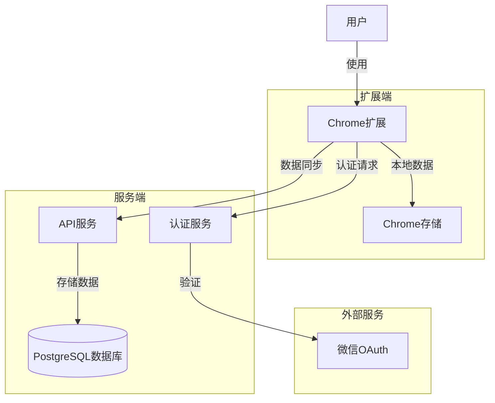
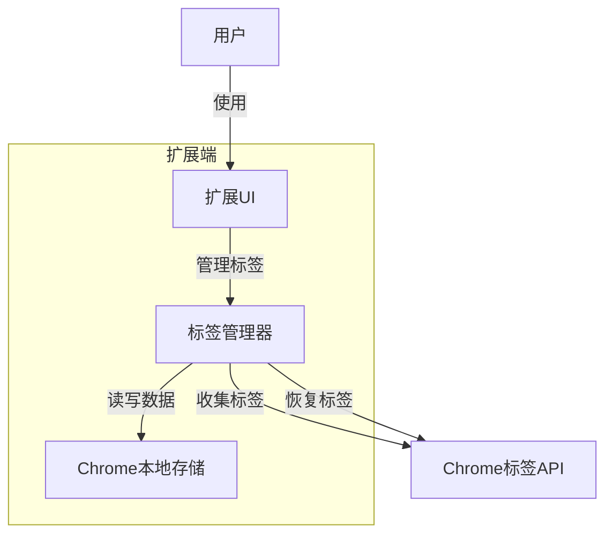
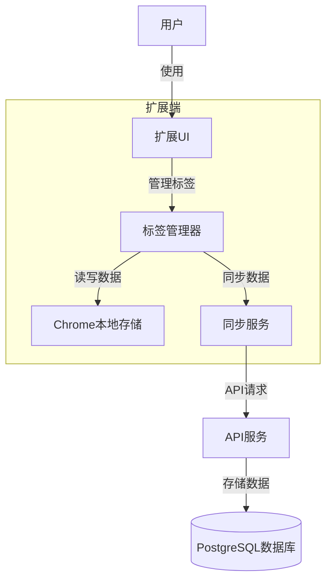

# OneTabPro 系统模式

## 系统架构概述

OneTabPro 采用模块化架构，包含扩展端和API服务端两个主要部分。扩展端负责用户界面、标签页操作和本地数据管理，API服务端负责云存储、认证和数据同步。系统设计遵循"离线优先"原则，确保基本功能在无网络或未登录状态下也能正常使用。



## 离线与在线模式架构

系统设计支持两种主要运行模式：离线模式和在线模式。

### 离线模式架构



### 在线模式架构



## 核心组件

### 1. 标签管理器 (TabManager)

标签管理器是系统的核心组件，负责标签页的收集、组织和恢复。

#### 责任:
- 收集当前窗口或所有窗口的标签页
- 将标签页保存到本地存储
- 从本地存储恢复标签页
- 管理标签组织，包括命名、排序等

#### 接口:
```typescript
interface TabManager {
  // 收集所有标签页并关闭原标签
  collectTabs(windowId?: number, excludeCurrentTab?: boolean): Promise<TabGroup>;
  
  // 恢复单个标签页
  restoreTab(tabId: string): Promise<boolean>;
  
  // 恢复整个标签组
  restoreGroup(groupId: string): Promise<boolean>;
  
  // 获取所有标签组
  getTabGroups(): Promise<TabGroup[]>;
  
  // 创建新标签组
  createTabGroup(name: string, tabs: Tab[]): Promise<TabGroup>;
  
  // 更新标签组
  updateTabGroup(groupId: string, updates: Partial<TabGroup>): Promise<boolean>;
  
  // 删除标签组
  deleteTabGroup(groupId: string): Promise<boolean>;
}
```

### 2. 存储服务 (StorageService)

存储服务负责离线数据的持久化，在离线和在线模式下都起关键作用。

#### 责任:
- 将标签数据保存到Chrome本地存储
- 从本地存储读取标签数据
- 管理存储限制和数据压缩
- 处理数据迁移和版本控制

#### 接口:
```typescript
interface StorageService {
  // 保存数据到本地存储
  save<T>(key: string, data: T): Promise<void>;
  
  // 从本地存储读取数据
  get<T>(key: string): Promise<T | null>;
  
  // 从本地存储删除数据
  remove(key: string): Promise<void>;
  
  // 清空所有数据
  clear(): Promise<void>;
  
  // 检查存储使用情况
  getStorageUsage(): Promise<{used: number, available: number}>;
}
```

### 3. 同步服务 (SyncService)

同步服务在用户登录时负责本地数据与云端的同步。

#### 责任:
- 检测用户登录状态变化
- 在用户首次登录时迁移本地数据
- 定期将本地更改同步到云端
- 处理同步冲突
- 从云端拉取更新

#### 接口:
```typescript
interface SyncService {
  // 初始化同步服务
  initialize(): Promise<void>;
  
  // 触发手动同步
  syncNow(): Promise<SyncResult>;
  
  // 设置自动同步间隔
  setAutoSyncInterval(intervalInMinutes: number): void;
  
  // 获取上次同步状态
  getLastSyncStatus(): SyncStatus;
  
  // 处理冲突
  resolveConflict(conflictStrategy: ConflictStrategy): Promise<void>;
}
```

### 4. 认证服务 (AuthService)

认证服务管理用户的身份验证和登录状态，在在线模式下使用。

#### 责任:
- 启动微信OAuth认证流程
- 管理访问令牌和刷新令牌
- 验证用户会话状态
- 处理登录和登出

#### 接口:
```typescript
interface AuthService {
  // 检查当前登录状态
  isLoggedIn(): boolean;
  
  // 启动登录流程
  login(): Promise<boolean>;
  
  // 登出
  logout(): Promise<void>;
  
  // 获取当前用户信息
  getCurrentUser(): User | null;
  
  // 获取身份验证令牌
  getToken(): string | null;
  
  // 注册认证状态变更监听器
  onAuthStateChanged(listener: (user: User | null) => void): () => void;
}
```

### 5. 用户界面组件 (UI Components)

#### 主要UI组件:

- **PopupComponent**: 扩展图标点击后显示的弹出窗口
- **TabListComponent**: 显示保存的标签页列表
- **TabGroupComponent**: 显示标签组及其操作
- **SettingsComponent**: 用户设置和首选项管理
- **LoginComponent**: 用户登录和账户管理

#### 状态管理:

系统使用React Context API进行状态管理，主要包含以下Context:

```typescript
// 标签状态上下文
const TabContext = createContext<{
  tabGroups: TabGroup[];
  activeGroup: string | null;
  loading: boolean;
  actions: TabContextActions;
}>({...});

// 认证状态上下文
const AuthContext = createContext<{
  user: User | null;
  isLoggedIn: boolean;
  isOnline: boolean;
  actions: AuthContextActions;
}>({...});

// 设置上下文
const SettingsContext = createContext<{
  settings: Settings;
  actions: SettingsContextActions;
}>({...});
```

## 数据模型

### 核心数据结构

```typescript
// 标签页
interface Tab {
  id: string;          // 唯一标识符
  url: string;         // 标签页URL
  title: string;       // 标签页标题
  favicon?: string;    // 图标URL
  createdAt: number;   // 创建时间戳
}

// 标签组
interface TabGroup {
  id: string;          // 唯一标识符
  name: string;        // 标签组名称
  tabs: Tab[];         // 标签页列表
  isLocked: boolean;   // 是否锁定
  createdAt: number;   // 创建时间戳
  updatedAt: number;   // 更新时间戳
}

// 用户
interface User {
  id: string;          // 唯一标识符
  name?: string;       // 用户名称
  wechatId?: string;   // 微信ID
  avatar?: string;     // 头像URL
}

// 设置
interface Settings {
  autoSyncEnabled: boolean;       // 是否启用自动同步
  autoSyncInterval: number;       // 自动同步间隔(分钟)
  openInNewTab: boolean;          // 恢复标签时是否在新标签页打开
  defaultGroupName: string;       // 默认标签组名称格式
  pinPopupWhenCollecting: boolean;// 收集标签时是否固定弹出窗口
}
```

### 存储结构

在Chrome本地存储中的数据组织:

```
chrome.storage.local = {
  "tabGroups": TabGroup[],             // 所有标签组
  "settings": Settings,                // 用户设置
  "lastSync": number,                  // 上次同步时间戳
  "user": User | null,                 // 当前登录用户
  "offlineOperations": Operation[],    // 离线操作队列
}
```

### 数据同步策略

系统采用"离线优先"策略处理数据同步:

1. **本地优先**: 所有操作首先在本地执行和保存
2. **后台同步**: 登录状态下，变更会自动同步到云端
3. **冲突解决**: 采用"最后写入获胜"策略，可通过时间戳比较
4. **离线操作队列**: 网络中断时，操作会进入队列，恢复连接后执行

## 主要流程

### 1. 标签页收集流程

```mermaid
sequenceDiagram
    参与者 User as 用户
    参与者 UI as 扩展UI
    参与者 TabManager as 标签管理器
    参与者 Storage as 存储服务
    参与者 ChromeAPI as Chrome API
    参与者 SyncService as 同步服务
    
    User->>UI: 点击扩展图标
    UI->>TabManager: collectTabs()
    TabManager->>ChromeAPI: chrome.tabs.query()
    ChromeAPI-->>TabManager: 返回当前标签列表
    TabManager->>Storage: 保存标签组
    Storage-->>TabManager: 保存成功
    TabManager->>ChromeAPI: chrome.tabs.remove()
    ChromeAPI-->>TabManager: 关闭原标签页
    TabManager-->>UI: 返回新标签组
    UI->>UI: 显示成功信息
    
    alt 用户已登录
        TabManager->>SyncService: 触发同步
        SyncService->>SyncService: 同步到云端
    end
```

### 2. 标签页恢复流程

```mermaid
sequenceDiagram
    参与者 User as 用户
    参与者 UI as 扩展UI
    参与者 TabManager as 标签管理器
    参与者 Storage as 存储服务
    参与者 ChromeAPI as Chrome API
    
    User->>UI: 点击标签或恢复按钮
    
    alt 恢复单个标签
        UI->>TabManager: restoreTab(tabId)
        TabManager->>Storage: 获取标签信息
        Storage-->>TabManager: 返回标签数据
        TabManager->>ChromeAPI: chrome.tabs.create()
        ChromeAPI-->>TabManager: 新标签页已创建
        TabManager->>Storage: 更新标签组状态
    else 恢复整个组
        UI->>TabManager: restoreGroup(groupId)
        TabManager->>Storage: 获取标签组
        Storage-->>TabManager: 返回标签组数据
        loop 每个标签
            TabManager->>ChromeAPI: chrome.tabs.create()
        end
        TabManager->>Storage: 更新标签组状态
    end
    
    TabManager-->>UI: 返回操作结果
    UI->>UI: 更新显示
```

### 3. 登录和数据同步流程

```mermaid
sequenceDiagram
    参与者 User as 用户
    参与者 UI as 扩展UI
    参与者 AuthService as 认证服务
    参与者 SyncService as 同步服务
    参与者 Storage as 存储服务
    参与者 API as API服务
    
    User->>UI: 点击登录按钮
    UI->>AuthService: login()
    AuthService->>AuthService: 启动微信OAuth流程
    AuthService-->>User: 显示二维码
    User->>AuthService: 扫描二维码
    AuthService->>API: 验证用户
    API-->>AuthService: 返回用户Token
    AuthService->>Storage: 保存用户信息
    AuthService-->>UI: 登录成功
    
    UI->>SyncService: 初始同步
    SyncService->>Storage: 获取本地数据
    Storage-->>SyncService: 返回本地数据
    SyncService->>API: 获取云端数据
    API-->>SyncService: 返回云端数据
    
    alt 首次登录
        SyncService->>SyncService: 迁移本地数据到云端
        SyncService->>API: 上传本地数据
    else 数据冲突
        SyncService->>SyncService: 解决冲突
    end
    
    SyncService->>Storage: 更新本地数据
    SyncService-->>UI: 同步完成
    UI->>UI: 更新显示
```

## 离线与在线模式转换

系统设计支持两种模式间的无缝转换：

### 离线到在线转换 (用户登录)

1. 用户完成登录
2. 系统自动扫描本地数据
3. 将所有本地数据上传到云端
4. 若云端已有数据，提供合并选项
5. 进入在线模式，启用自动同步

### 在线到离线转换 (用户登出或网络中断)

1. 检测到用户登出或网络中断
2. 系统继续使用本地存储的数据
3. 所有操作保存到本地
4. 若为临时网络中断，操作进入离线队列
5. 网络恢复后自动同步离线操作

## 技术实现

### 扩展技术栈

- **框架**: React + TypeScript
- **状态管理**: React Context API
- **样式**: TailwindCSS
- **构建工具**: Vite
- **Chrome API**: 使用Chrome Extension Manifest V3

### API服务技术栈

- **框架**: Hono.js
- **数据库**: PostgreSQL (Neon)
- **ORM**: Prisma
- **认证**: JWT
- **部署**: Vercel Serverless

## 安全考虑

1. **数据保护**
   - 本地数据使用Chrome的隔离存储
   - 敏感数据不存储在localStorage

2. **认证安全**
   - 使用微信OAuth进行安全认证
   - JWT令牌有适当的过期时间

3. **云同步安全**
   - API端点要求有效的认证令牌
   - 数据传输使用HTTPS加密
   - 实施资源隔离，确保用户只能访问自己的数据

## 扩展性与可维护性

系统设计考虑以下扩展性因素:

1. **模块化架构**
   - 核心组件通过清晰接口分离
   - 服务可独立升级或替换

2. **插件化功能**
   - 将高级功能设计为可选插件
   - 允许根据用户需求定制功能

3. **版本兼容性**
   - 数据模型包含版本标记
   - 支持数据模型向前兼容的迁移

4. **测试策略**
   - 每个核心组件有单元测试
   - 关键流程有集成测试
   - 使用模拟服务进行端到端测试

# 系统模式

本文档详细描述了 OneTabPro 的系统架构和设计模式，作为开发团队的参考指南。

## 整体架构

OneTabPro 采用分层架构，将系统分为以下几个主要部分：

1. **Chrome 扩展前端** - 用户交互界面和本地存储
2. **后端 API 服务** - 提供数据同步和身份验证服务
3. **数据库层** - 存储用户和标签数据

```
+---------------------+      +----------------+      +-----------------+
|                     |      |                |      |                 |
|  Chrome扩展前端     | <--> |  后端API服务   | <--> |  数据库层       |
|  (React + TailwindCSS)|    |  (Node.js + Hono)|   |  (PostgreSQL)    |
|                     |      |                |      |                 |
+---------------------+      +----------------+      +-----------------+
```

## 扩展架构

Chrome 扩展采用 Manifest V3 标准，包含以下主要组件：

### 组件

1. **后台服务(Service Worker)**

   - 负责标签页的收集和管理
   - 使用 Chrome API 监听标签页事件
   - 与后端 API 通信以同步数据

2. **弹出界面(Popup)**

   - 提供用户交互界面
   - 显示已保存的标签组
   - 允许用户恢复、删除和管理标签组
   - 使用 React 实现的组件化界面

3. **设置页面(Options)**

   - 允许用户自定义扩展行为
   - 管理账户和同步设置
   - 高级选项配置

4. **本地存储**
   - 使用 Chrome 存储 API 存储标签数据
   - 缓存用户设置和认证信息
   - 实现离线功能

### 数据流

```
  用户交互          弹出界面/设置页面          后台服务            本地存储
    |                     |                    |                  |
    | ----操作请求------> |                    |                  |
    |                     | ---处理请求------> |                  |
    |                     |                    | ---存储数据----> |
    |                     |                    | <--读取数据----- |
    | <---操作响应------- | <--返回结果------- |                  |
```

## API 服务架构

后端 API 服务采用 RESTful 架构，使用 Node.js 和 Hono.js 框架实现。

### API 路由结构

1. **身份验证路由 `/auth`**

   - `/auth/wechat`: 微信 OAuth 认证
   - `/auth/wechat/callback`: 认证回调
   - `/auth/token`: 令牌验证和刷新

2. **标签组路由 `/tab-groups`**

   - `GET /tab-groups`: 获取所有标签组
   - `POST /tab-groups`: 创建新标签组
   - `GET /tab-groups/:id`: 获取特定标签组
   - `PUT /tab-groups/:id`: 更新标签组
   - `DELETE /tab-groups/:id`: 删除标签组

3. **用户路由 `/users`**

   - `GET /users/me`: 获取当前用户信息
   - `PUT /users/me`: 更新用户设置

4. **同步路由 `/sync`**
   - `POST /sync`: 同步本地和云端数据

### API 实现模式

1. **中间件链模式**

   - 身份验证中间件 - 验证令牌和用户权限
   - 请求验证中间件 - 使用 Zod 验证请求数据
   - 错误处理中间件 - 统一处理 API 错误

   示例：

   ```typescript
   // 标签组路由中间件链
   app.use("/tab-groups/*", authMiddleware);
   app.get("/tab-groups", validateRequest, getTabGroupsHandler);
   app.post("/tab-groups", validateRequest, createTabGroupHandler);
   ```

2. **控制器模式**

   - 每个路由端点对应一个专用控制器函数
   - 控制器负责处理请求、调用服务层并返回响应
   - 集中错误处理和日志记录

   示例：

   ```typescript
   // 获取标签组控制器
   async function getTabGroupsHandler(c: Context) {
     try {
       const userId = c.get("userId");
       const tabGroups = await tabGroupService.getAllByUserId(userId);
       return c.json({ success: true, data: tabGroups });
     } catch (error) {
       return handleError(c, error);
     }
   }
   ```

3. **服务层模式**

   - 实现业务逻辑和数据访问
   - 与数据库交互并转换数据格式
   - 实现缓存和性能优化策略

4. **请求验证模式**

   - 使用 Zod 定义请求模式
   - 在处理请求前验证数据
   - 提供清晰的错误消息

   示例：

   ```typescript
   // 创建标签组请求验证
   const createTabGroupSchema = z.object({
     name: z.string().min(1).max(100),
     tabs: z.array(
       z.object({
         title: z.string(),
         url: z.string().url(),
         favicon: z.string().optional(),
       })
     ),
   });
   ```

5. **响应格式化模式**

   - 统一的 JSON 响应格式
   - 包含 success 标志、数据和错误信息
   - 使用适当的 HTTP 状态码

   示例响应:

   ```json
   {
     "success": true,
     "data": {
       "id": "tab-group-123",
       "name": "工作相关",
       "createdAt": "2023-04-02T10:30:00Z",
       "tabs": [...]
     }
   }
   ```

   错误响应:

   ```json
   {
     "success": false,
     "error": {
       "code": "NOT_FOUND",
       "message": "标签组不存在"
     }
   }
   ```

## 数据库架构

数据库使用 PostgreSQL，通过 Prisma ORM 进行管理。

### 核心数据模型

1. **用户模型 (users)**

   - 存储用户基本信息和认证数据
   - 关联到该用户的所有标签组

2. **标签组模型 (tab_groups)**

   - 存储标签组元数据
   - 关联到单个用户
   - 关联到多个标签

3. **标签模型 (tabs)**
   - 存储单个标签页的数据
   - 关联到单个标签组

### 数据关系

```
+------------+       +---------------+       +--------+
|            |       |               |       |        |
|   用户     | 1---n |   标签组      | 1---n |  标签  |
|  (users)   |       | (tab_groups)  |       | (tabs) |
|            |       |               |       |        |
+------------+       +---------------+       +--------+
```

## 认证机制

认证流程基于 OAuth 2.0 协议和 JWT 令牌，步骤如下：

1. 用户通过微信扫码登录
2. 获取授权码并在后端交换访问令牌
3. 生成 JWT 令牌并返回给扩展
4. 扩展在本地存储令牌并在后续 API 请求中使用

```
  用户        扩展        后端API        微信OAuth
   |           |             |              |
   | --登录--> |             |              |
   |           | --请求----> |              |
   |           |             | --授权请求-> |
   | <--扫码-- |             |              |
   | --确认--> |             |              |
   |           |             | <--授权码--- |
   |           |             | --交换令牌-> |
   |           |             | <--令牌----- |
   |           | <--JWT----- |              |
   |           | --存储令牌  |              |
   | <--完成-- |             |              |
```

## 数据同步机制

数据同步采用基于时间戳的冲突解决策略：

1. 客户端记录每个操作的时间戳
2. 服务器比较本地和远程时间戳
3. 根据最后修改时间确定操作优先级
4. 自动解决冲突并通知用户

## 本地存储策略

扩展使用分层存储策略：

1. **用户设置** - Chrome 存储 API (sync)
2. **会话数据** - Chrome 存储 API (local)
3. **认证令牌** - Chrome 存储 API (local)，加密存储
4. **临时缓存** - IndexedDB 用于大型数据集

## 错误处理模式

系统实现全面的错误处理策略：

1. **前端错误处理**

   - 使用 try/catch 捕获异步错误
   - 全局错误边界处理 React 渲染错误
   - 用户友好的错误提示

2. **API 错误处理**

   - 统一的错误响应格式
   - 详细的错误代码和消息
   - 错误日志记录

3. **离线错误处理**
   - 网络错误检测和重试机制
   - 本地数据备份和恢复
   - 同步冲突解决策略
