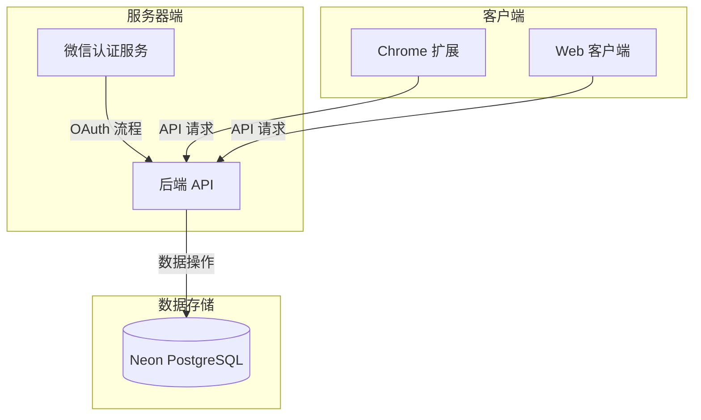
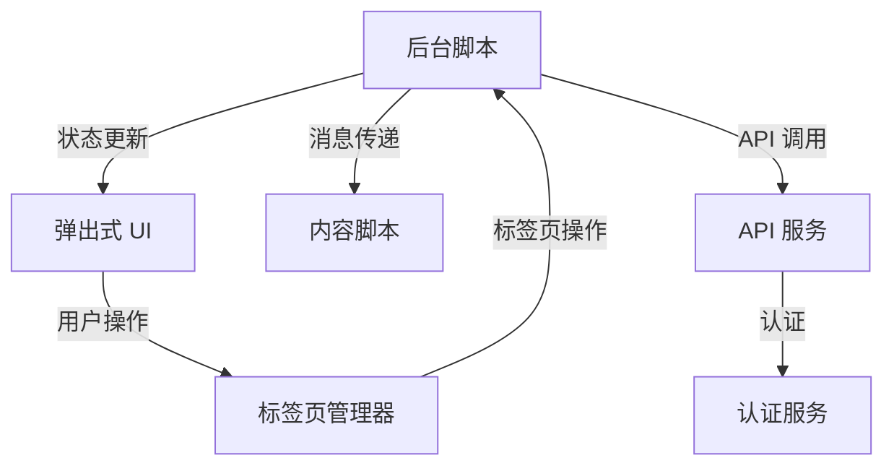
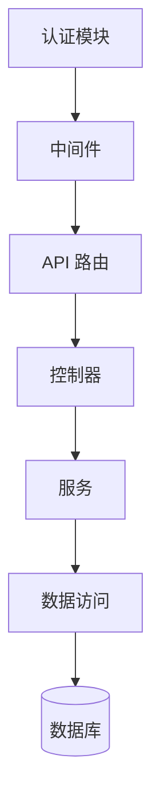
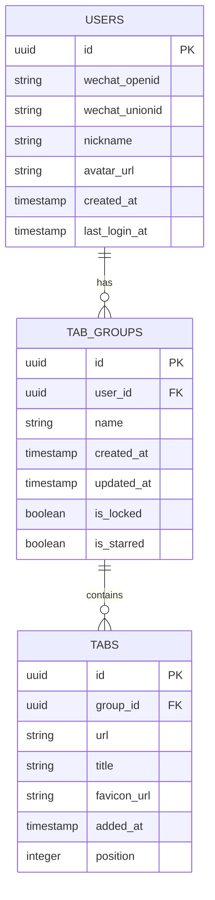

# OneTabPro 系统模式

## 系统架构

OneTabPro 遵循客户端-服务器架构，包含以下组件：



### 关键组件

1. **Chrome 扩展 (客户端)**

   - 标签页管理用户界面
   - 本地状态管理
   - API 通信层
   - 认证处理器

2. **后端 API (服务器)**

   - 数据操作的 RESTful 端点
   - 认证和授权
   - 微信 OAuth 集成
   - 数据验证和业务逻辑

3. **Neon PostgreSQL (数据库)**

   - 无服务器 PostgreSQL 数据库
   - 存储用户数据、标签组和标签页
   - 处理数据持久化和查询

4. **Web 客户端 (可选)**
   - 查看已保存标签页的替代界面
   - 与扩展共享 API 通信

## 设计模式

### 扩展架构

Chrome 扩展遵循模块化架构：



1. **后台脚本模式**

   - 处理事件的长期运行脚本
   - 维护扩展状态
   - 协调各组件之间的通信
   - 管理标签页操作

2. **UI 组件模式**

   - React 组件层次结构
   - 单向数据流
   - 容器/展示组件模式

3. **服务层模式**
   - 用于后端通信的 API 服务
   - 用于令牌管理的认证服务
   - 用于浏览器操作的标签页服务

### 后端架构

后端遵循分层架构，明确关注点分离：



1. **控制器-服务-仓库模式**

   - 控制器处理 HTTP 请求/响应
   - 服务包含业务逻辑
   - 仓库管理数据访问

2. **中间件模式**

   - 认证中间件
   - 请求验证
   - 错误处理
   - 日志记录和监控

3. **JWT 认证模式**
   - 基于令牌的认证
   - 无状态授权
   - 安全令牌存储

## 数据模型

### 核心数据实体



## 通信模式

1. **REST API 通信**

   - 标准 HTTP 方法 (GET, POST, PUT, DELETE)
   - JSON 请求/响应格式
   - 通过 Authorization 头部进行 JWT 认证
   - 版本化 API 端点

2. **微信 OAuth 流程**

   - 标准 OAuth 2.0 授权码流程
   - 基于二维码的认证
   - 用户信息的令牌交换

3. **数据同步**
   - 拉取式同步 (客户端发起)
   - 基于时间戳的冲突解决
   - 批量操作以提高效率

## 安全模式

1. **认证与授权**

   - 具有适当过期时间的 JWT 令牌
   - 所有通信使用 HTTPS
   - 基于资源的授权

2. **数据保护**

   - 输入验证
   - 数据库查询的预处理语句
   - 扩展的内容安全策略

3. **隐私考虑**
   - 最小数据收集
   - 用户数据控制
   - 清晰的隐私政策

## 错误处理模式

1. **客户端错误处理**

   - 优雅降级
   - 网络失败的重试逻辑
   - 用户友好的错误消息

2. **服务器端错误处理**
   - 结构化错误响应
   - 适当的 HTTP 状态码
   - 详细日志记录 (非用户可见)

## 性能模式

1. **客户端优化**

   - 高效的 DOM 操作
   - 频繁访问数据的本地缓存
   - 防抖/节流的事件处理

2. **服务器优化**
   - 查询优化
   - 连接池
   - 响应压缩

# 系统模式

本文档详细描述了 OneTabPro 的系统架构和设计模式，作为开发团队的参考指南。

## 整体架构

OneTabPro 采用分层架构，将系统分为以下几个主要部分：

1. **Chrome 扩展前端** - 用户交互界面和本地存储
2. **后端 API 服务** - 提供数据同步和身份验证服务
3. **数据库层** - 存储用户和标签数据

```
+---------------------+      +----------------+      +-----------------+
|                     |      |                |      |                 |
|  Chrome扩展前端     | <--> |  后端API服务   | <--> |  数据库层       |
|  (React + TailwindCSS)|    |  (Node.js + Hono)|   |  (PostgreSQL)    |
|                     |      |                |      |                 |
+---------------------+      +----------------+      +-----------------+
```

## 扩展架构

Chrome 扩展采用 Manifest V3 标准，包含以下主要组件：

### 组件

1. **后台服务(Service Worker)**

   - 负责标签页的收集和管理
   - 使用 Chrome API 监听标签页事件
   - 与后端 API 通信以同步数据

2. **弹出界面(Popup)**

   - 提供用户交互界面
   - 显示已保存的标签组
   - 允许用户恢复、删除和管理标签组
   - 使用 React 实现的组件化界面

3. **设置页面(Options)**

   - 允许用户自定义扩展行为
   - 管理账户和同步设置
   - 高级选项配置

4. **本地存储**
   - 使用 Chrome 存储 API 存储标签数据
   - 缓存用户设置和认证信息
   - 实现离线功能

### 数据流

```
  用户交互          弹出界面/设置页面          后台服务            本地存储
    |                     |                    |                  |
    | ----操作请求------> |                    |                  |
    |                     | ---处理请求------> |                  |
    |                     |                    | ---存储数据----> |
    |                     |                    | <--读取数据----- |
    | <---操作响应------- | <--返回结果------- |                  |
```

## API 服务架构

后端 API 服务采用 RESTful 架构，使用 Node.js 和 Hono.js 框架实现。

### API 路由结构

1. **身份验证路由 `/auth`**

   - `/auth/wechat`: 微信 OAuth 认证
   - `/auth/wechat/callback`: 认证回调
   - `/auth/token`: 令牌验证和刷新

2. **标签组路由 `/tab-groups`**

   - `GET /tab-groups`: 获取所有标签组
   - `POST /tab-groups`: 创建新标签组
   - `GET /tab-groups/:id`: 获取特定标签组
   - `PUT /tab-groups/:id`: 更新标签组
   - `DELETE /tab-groups/:id`: 删除标签组

3. **用户路由 `/users`**

   - `GET /users/me`: 获取当前用户信息
   - `PUT /users/me`: 更新用户设置

4. **同步路由 `/sync`**
   - `POST /sync`: 同步本地和云端数据

### API 实现模式

1. **中间件链模式**

   - 身份验证中间件 - 验证令牌和用户权限
   - 请求验证中间件 - 使用 Zod 验证请求数据
   - 错误处理中间件 - 统一处理 API 错误

   示例：

   ```typescript
   // 标签组路由中间件链
   app.use("/tab-groups/*", authMiddleware);
   app.get("/tab-groups", validateRequest, getTabGroupsHandler);
   app.post("/tab-groups", validateRequest, createTabGroupHandler);
   ```

2. **控制器模式**

   - 每个路由端点对应一个专用控制器函数
   - 控制器负责处理请求、调用服务层并返回响应
   - 集中错误处理和日志记录

   示例：

   ```typescript
   // 获取标签组控制器
   async function getTabGroupsHandler(c: Context) {
     try {
       const userId = c.get("userId");
       const tabGroups = await tabGroupService.getAllByUserId(userId);
       return c.json({ success: true, data: tabGroups });
     } catch (error) {
       return handleError(c, error);
     }
   }
   ```

3. **服务层模式**

   - 实现业务逻辑和数据访问
   - 与数据库交互并转换数据格式
   - 实现缓存和性能优化策略

4. **请求验证模式**

   - 使用 Zod 定义请求模式
   - 在处理请求前验证数据
   - 提供清晰的错误消息

   示例：

   ```typescript
   // 创建标签组请求验证
   const createTabGroupSchema = z.object({
     name: z.string().min(1).max(100),
     tabs: z.array(
       z.object({
         title: z.string(),
         url: z.string().url(),
         favicon: z.string().optional(),
       })
     ),
   });
   ```

5. **响应格式化模式**

   - 统一的 JSON 响应格式
   - 包含 success 标志、数据和错误信息
   - 使用适当的 HTTP 状态码

   示例响应:

   ```json
   {
     "success": true,
     "data": {
       "id": "tab-group-123",
       "name": "工作相关",
       "createdAt": "2023-04-02T10:30:00Z",
       "tabs": [...]
     }
   }
   ```

   错误响应:

   ```json
   {
     "success": false,
     "error": {
       "code": "NOT_FOUND",
       "message": "标签组不存在"
     }
   }
   ```

## 数据库架构

数据库使用 PostgreSQL，通过 Prisma ORM 进行管理。

### 核心数据模型

1. **用户模型 (users)**

   - 存储用户基本信息和认证数据
   - 关联到该用户的所有标签组

2. **标签组模型 (tab_groups)**

   - 存储标签组元数据
   - 关联到单个用户
   - 关联到多个标签

3. **标签模型 (tabs)**
   - 存储单个标签页的数据
   - 关联到单个标签组

### 数据关系

```
+------------+       +---------------+       +--------+
|            |       |               |       |        |
|   用户     | 1---n |   标签组      | 1---n |  标签  |
|  (users)   |       | (tab_groups)  |       | (tabs) |
|            |       |               |       |        |
+------------+       +---------------+       +--------+
```

## 认证机制

认证流程基于 OAuth 2.0 协议和 JWT 令牌，步骤如下：

1. 用户通过微信扫码登录
2. 获取授权码并在后端交换访问令牌
3. 生成 JWT 令牌并返回给扩展
4. 扩展在本地存储令牌并在后续 API 请求中使用

```
  用户        扩展        后端API        微信OAuth
   |           |             |              |
   | --登录--> |             |              |
   |           | --请求----> |              |
   |           |             | --授权请求-> |
   | <--扫码-- |             |              |
   | --确认--> |             |              |
   |           |             | <--授权码--- |
   |           |             | --交换令牌-> |
   |           |             | <--令牌----- |
   |           | <--JWT----- |              |
   |           | --存储令牌  |              |
   | <--完成-- |             |              |
```

## 数据同步机制

数据同步采用基于时间戳的冲突解决策略：

1. 客户端记录每个操作的时间戳
2. 服务器比较本地和远程时间戳
3. 根据最后修改时间确定操作优先级
4. 自动解决冲突并通知用户

## 本地存储策略

扩展使用分层存储策略：

1. **用户设置** - Chrome 存储 API (sync)
2. **会话数据** - Chrome 存储 API (local)
3. **认证令牌** - Chrome 存储 API (local)，加密存储
4. **临时缓存** - IndexedDB 用于大型数据集

## 错误处理模式

系统实现全面的错误处理策略：

1. **前端错误处理**

   - 使用 try/catch 捕获异步错误
   - 全局错误边界处理 React 渲染错误
   - 用户友好的错误提示

2. **API 错误处理**

   - 统一的错误响应格式
   - 详细的错误代码和消息
   - 错误日志记录

3. **离线错误处理**
   - 网络错误检测和重试机制
   - 本地数据备份和恢复
   - 同步冲突解决策略
