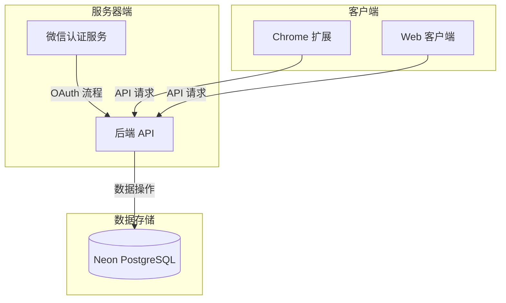
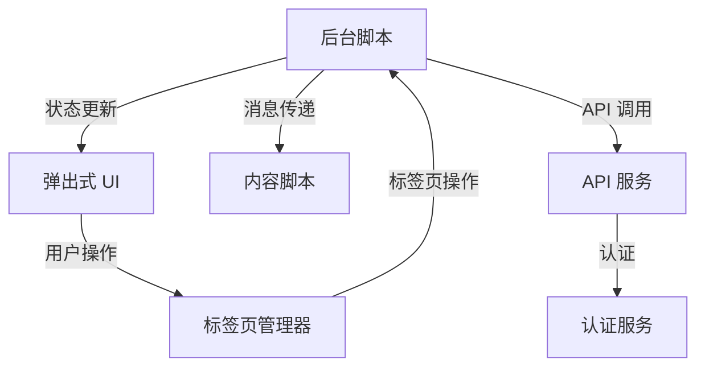
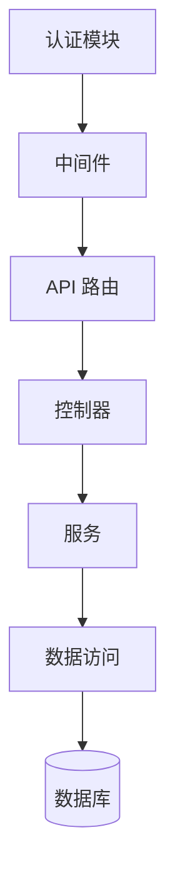
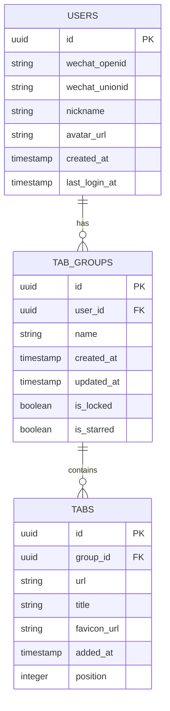

# OneTabPro 系统模式

## 系统架构

OneTabPro 遵循客户端-服务器架构，包含以下组件：

### 关键组件

1. **Chrome 扩展 (客户端)**

   - 标签页管理用户界面
   - 本地状态管理
   - API 通信层
   - 认证处理器

2. **后端 API (服务器)**

   - 数据操作的 RESTful 端点
   - 认证和授权
   - 微信 OAuth 集成
   - 数据验证和业务逻辑

3. **Neon PostgreSQL (数据库)**

   - 无服务器 PostgreSQL 数据库
   - 存储用户数据、标签组和标签页
   - 处理数据持久化和查询

4. **Web 客户端 (可选)**
   - 查看已保存标签页的替代界面
   - 与扩展共享 API 通信

## 设计模式

### 扩展架构

Chrome 扩展遵循模块化架构：

1. **后台脚本模式**

   - 处理事件的长期运行脚本
   - 维护扩展状态
   - 协调各组件之间的通信
   - 管理标签页操作

2. **UI 组件模式**

   - React 组件层次结构
   - 单向数据流
   - 容器/展示组件模式

3. **服务层模式**
   - 用于后端通信的 API 服务
   - 用于令牌管理的认证服务
   - 用于浏览器操作的标签页服务

### 后端架构

后端遵循分层架构，明确关注点分离：

1. **控制器-服务-仓库模式**

   - 控制器处理 HTTP 请求/响应
   - 服务包含业务逻辑
   - 仓库管理数据访问

2. **中间件模式**

   - 认证中间件
   - 请求验证
   - 错误处理
   - 日志记录和监控

3. **JWT 认证模式**
   - 基于令牌的认证
   - 无状态授权
   - 安全令牌存储

## 数据模型

### 核心数据实体

## 通信模式

1. **REST API 通信**

   - 标准 HTTP 方法 (GET, POST, PUT, DELETE)
   - JSON 请求/响应格式
   - 通过 Authorization 头部进行 JWT 认证
   - 版本化 API 端点

2. **微信 OAuth 流程**

   - 标准 OAuth 2.0 授权码流程
   - 基于二维码的认证
   - 用户信息的令牌交换

3. **数据同步**
   - 拉取式同步 (客户端发起)
   - 基于时间戳的冲突解决
   - 批量操作以提高效率

## 安全模式

1. **认证与授权**

   - 具有适当过期时间的 JWT 令牌
   - 所有通信使用 HTTPS
   - 基于资源的授权

2. **数据保护**

   - 输入验证
   - 数据库查询的预处理语句
   - 扩展的内容安全策略

3. **隐私考虑**
   - 最小数据收集
   - 用户数据控制
   - 清晰的隐私政策

## 错误处理模式

1. **客户端错误处理**

   - 优雅降级
   - 网络失败的重试逻辑
   - 用户友好的错误消息

2. **服务器端错误处理**
   - 结构化错误响应
   - 适当的 HTTP 状态码
   - 详细日志记录 (非用户可见)

## 性能模式

1. **客户端优化**

   - 高效的 DOM 操作
   - 频繁访问数据的本地缓存
   - 防抖/节流的事件处理

2. **服务器优化**
   - 查询优化
   - 连接池
   - 响应压缩
